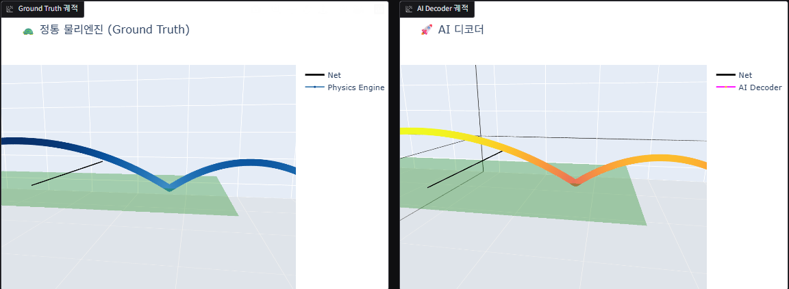
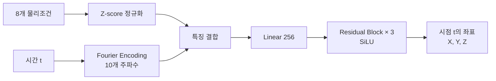
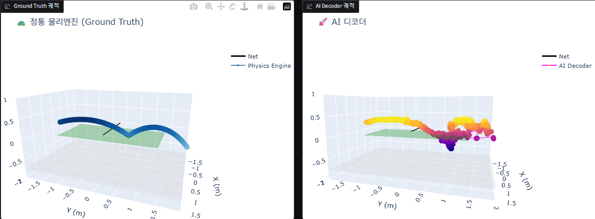

# Table Tennis Trajectory Surrogate Model

SciPy `solve_ivp` 기반 탁구공 물리엔진의 궤도 계산을 신경망으로 근사한 개인 연구 프로젝트입니다. 8개의 초기 물리조건과 시간 `t`를 입력받아 해당 시점의 3D 좌표를 예측하고, 750개 시점을 배치 추론하여 1.5초 궤도를 생성합니다.

[포트폴리오에서 자세히 보기](https://app.notion.com/p/3bc6bf3fc83581d19e67c7538c53b30e)



## 핵심 결과

평가 데이터에서 무작위로 추출한 1,000개 궤적을 기준으로 측정했습니다.

| 항목 | 결과 | 조건 |
|---|---:|---|
| 평균 궤적 오차 | MAE 4.62 mm, RMSE 6.99 mm | 유효 구간의 3D 점 간 거리 |
| 속도 상위 5% | MAE 4.73 mm | 50개 궤적 |
| 스핀 크기 상위 5% | MAE 3.57 mm | 50개 궤적 |
| CPU 단일 궤적 지연시간 | 7.65 ms → 1.42 ms | 지연시간 81.4% 감소(추론 속도 약 5.3배 향상) |
| GPU 배치 처리량 | 131개/s → 8,780개/s | RTX 3070, batch 500, 약 67배 |

- CPU 결과는 Intel Core i7-10700KF에서 1,000개 궤적을 순차 추론한 평균 지연시간입니다.
- GPU 결과는 물리엔진의 순차 처리량과 GPU 배치 처리량을 비교한 값입니다.
- 전체 수치는 [`results/benchmark_report.json`](results/benchmark_report.json)에서 확인할 수 있습니다.

## 데이터

- **물리조건 8개:** 초기 타격 속도, 수직 발사각, 탑스핀, 사이드스핀, 타격 위치 X/Y/Z, 수평 타격 방향각
- **정답:** `solve_ivp` 기반 물리엔진이 생성한 3D 궤도
- **길이:** `dt=0.002초`, 750스텝, 총 1.5초
- **샘플링:** 속도는 절단 로그정규분포, 나머지 변수는 절단 정규분포
- **생성 설정:** 5,000,000개 궤적
- **분할:** 학습 80%, 평가 20%, 난수 시드 42

## 모델 구조



시간 `t`에는 `2^0`부터 `2^9`까지 10개 주파수의 sine/cosine Fourier Encoding을 적용했습니다. 최종 입력은 물리조건 8개와 시간 특징 21개를 합친 29차원이며, 모델은 한 시점의 3D 좌표를 출력합니다.

바닥 도달 이후의 패딩 구간은 손실에서 제외하고 순수 L1 Loss로 학습했습니다. 이를 통해 Smooth L1에서 발생했던 바운스 평활화를 줄였습니다.

## 시행착오

전체 궤도를 한 번에 회귀하는 MLP에서 시작해 손실함수, 마스킹, ResNet, 1D CNN, Time-Conditioned MLP를 차례로 실험했습니다.

| 1D CNN Decoder | Time-Conditioned MLP |
|---|---|
|  |  |
| 반복 노이즈와 checkerboard artifact 발생 | Fourier Encoding, Residual Block, SiLU, L1 Loss 적용 |

19차례 실험의 시각화는 [`results/`](results)에서, 구체적인 실험 기록은 [`RESEARCH_NOTES.md`](RESEARCH_NOTES.md)에서 확인할 수 있습니다.

## 실행 방법

공개 모델 가중치와 정규화 파일은 각각 `artifacts/final_model.pth`, `artifacts/final_norm.npy`에 있습니다. 전체 500만 개 학습 데이터셋은 용량 때문에 포함하지 않았습니다.

1. 의존성을 설치합니다.

   ```bash
   pip install -r requirements.txt
   ```

2. 공개 파일을 사용하는 시뮬레이터를 실행합니다.

   ```bash
   python app.py
   ```

공개 파일만으로 모델 추론은 가능하지만, 과거 벤치마크에 사용한 동일 평가 표본의 재현은 이번 공개 범위에 포함되지 않습니다. `generate_dataset.py`는 기본 설정에서 500만 개 궤적을 생성하므로 충분한 저장공간과 실행시간이 필요합니다.

## 주요 파일

```text
generate_dataset.py   물리엔진 기반 데이터 생성
train_baseline.py     Time-Conditioned MLP 학습
benchmark.py          정확도·지연시간·처리량 평가
app.py                Gradio 시뮬레이터
results/              시행착오 시각화와 벤치마크 결과
RESEARCH_NOTES.md     19차례 실험 기록
```

## 한계

- 평균 오차는 4.62 mm지만 평가 표본에서 최대 3,141.88 mm의 드문 이상치가 확인되었습니다.
- 최고 Fourier 주파수에서 고주파 아티팩트와 가짜 바운스가 발생할 수 있습니다.
- 현재 80:20 분할의 평가 세트를 조기 종료와 최적 모델 선택에도 사용했습니다. 별도의 검증·최종 평가 세트를 사용한 재평가가 필요합니다.
- GT는 순차 실행, GPU는 배치 실행으로 측정했으므로 동일한 동시성 조건의 추가 비교가 필요합니다.

## Author

**Lee San (이산)** · Sejong University, Software
