# 🏓 탁구 AI 물리 엔진 연구 노트 (MLP Physics Decoder)
> **마지막 업데이트: 2026-05-29**

---

## 🎯 최종 목표 (연구의 본질)
복잡하고 무거운 수학적 물리 연산(SciPy `solve_ivp`, RK45)을 매 런타임마다 수행하는 대신, 물리 법칙의 결과를 학습한 **인공지능 모델**이 빠른 추론(Inference)으로 500스텝의 3D 궤적을 즉시 렌더링하도록 만듭니다.

**핵심 철학: Physics as a Neural Network**
- **데이터 생성:** 공기저항, 마그누스 효과, 중력, 탁구대 경계, 말랑한 네트 충돌(Soft-wall), 바닥 추락 등의 법칙이 적용된 정밀한 수학적 시뮬레이터로 300만 개의 합성 데이터를  찍어냅니다. 
- **다차원 학습:** 생성된 방대한 8차원 공간의 파라미터(입력)와 500스텝 궤적(출력)의 관계를 AI가 근사(Approximation)하도록 학습시킵니다.
- **초고속 렌더링:** 런타임에는 미분방정식 없이 행렬 곱셈만으로 궤적을 뱉어내어, 물리 엔진 대비 속도 향상을 이뤄냅니다. (압도적인 속도는 이 연구의 본질입니다.)

---

## 🏗️ 파이프라인 설계

### Step 1. 시뮬레이터 설계 및 데이터 생성 (Data Generation)
- **파일:** `generate_dataset.py`, `app.py` (내부 `traditional_physics_solver`)
- **수학적 물리 엔진의 진화 (World Coordinate Physics):**
  - 기존의 Z=0 무한 평면 반사를 폐기하고, **절대 월드 좌표계**를 도입했습니다.
  - **탁구대 경계:** `|X| <= 0.76m`, `|Y| <= 1.37m` 내에서만 Z=0 충돌 감지. 아웃되면 바닥(`Z=-0.76m`)까지 자유 낙하.
  - **말랑한 네트(Soft Wall):** 공이 중앙(`Y=0`)을 지날 때 네트 높이(`Z <= 0.1525m`) 이하면 네트에 걸리며, 네트 장력을 받아 `Vy`가 반대로 꺾이면서 감쇠되는 현실적인 텐션 로직 구현.
- **데이터 추출:** 랜덤하게 샘플링된 300만 개의 8D 입력을 물리 엔진에 넣어 정답지(1500D) 세트를 추출. (`dataset_random.npz`로 저장)

### Step 2. AI 물리 모델 아키텍처 진화 (Evolution of Physics Decoder)
- **파일:** `train_baseline.py`
- **현재 구조 (Expanding MLP):**
  - 차원이 점진적으로 넓어지는 순수 확장형 구조 (`8 -> 256 -> 512 -> 1024 -> 1500`) 도입.
  - 기교(ResNet 등) 없이 가장 단순한 형태의 다층 퍼셉트론으로 회귀.
- **손실 함수 (Loss):** 기본 L2 Loss (MSE Loss) 적용
- **데이터셋 처리:** 300만 개 데이터 Z-score 정규화 (`mlp_norm_standard_random.npy`).

### Step 3. 비교 검증 UI (Gradio Dashboard)
- **파일:** `app.py`
- 런타임에 사용자가 8차원 슬라이더를 조절하면, **[수학적 물리 엔진]**과 **[AI 물리 디코더]**가 동시에 궤적을 그리고 그 L2 오차(Error)와 속도 차이(Speedup)를 화면에 3D로 비교 렌더링합니다.

---

## 📐 AI 입출력 파라미터 (8D -> 1500D)

### 입력: 8D Input Features (World Coordinates)
| 인덱스 | 파라미터 | 설명 | 범위 |
|---|---|---|---|
| 0 | speed | 초기 타격 속도 (m/s) | 1 ~ 80 |
| 1 | θ_v | 수직 발사각 (°) | -50 ~ 50|
| 2 | ω_top | 탑스핀 (rad/s, + 탑 / - 백) | -200 ~ 200 |
| 3 | ω_side | 사이드스핀 (rad/s) | -200 ~ 200 |
| 4 | hit_x | 타격 좌우 위치 (m) | -3 ~ 3 |
| 5 | hit_y | 타격 앞뒤 위치 (m) | -4 ~ 0 |
| 6 | hit_z | 타격 높이 (m) | -0.76 ~ 1.5 |
| 7 | θ_h | 수평 타격 방향각 (°) | -65 ~ 65 |
### 출력: 1500D Output Trajectory
- 500 스텝 × 3차원 좌표 (X, Y, Z) = 1500개의 Float 값.
- 시간 간격 `dt = 0.002초`, 총 1.0초 길이의 궤적.

---

## 💻 하드웨어 스펙 및 학습 최적화 가이드라인

이 프로젝트는 현재 로컬 딥러닝 워크스테이션 환경에 맞춰 최적화되어 있습니다.

### 시스템 스펙
- **GPU:** NVIDIA GeForce RTX 3070 (VRAM 8GB)
- **System RAM:** 약 128GB (가용 121GiB)

### 최적화 가이드 (반드시 지킬 것)
1. **Batch Size 극대화:** GPU VRAM이 8GB로 제한적이나, 현재 다층 퍼셉트론(MLP) 모델의 파라미터가 매우 가벼우므로 GPU 병렬 처리를 위해 `BATCH_SIZE = 4096` 이상을 적극 권장합니다. (에포크 훈련 속도 기하급수적 향상)
2. **데이터 로딩 전략:** 시스템 RAM(128GB)이 엄청나게 넉넉하므로 300만 개 이상의 데이터(약 18GB)도 디스크 I/O 병목을 피하기 위해 메모리에 한 번에 적재(`TensorDataset`)하여 사용합니다.
3. **DataLoader `num_workers = 0` 고정:** 데이터가 이미 시스템 RAM에 통째로 올라가 있기 때문에, `num_workers`를 늘리면 서브 프로세스 간에 거대한 데이터를 공유 메모리(`/dev/shm`)로 복사하려다 **Bus Error (SIGBUS)**와 함께 거대한 코어 덤프(Core Dump, 프로세스당 35GB)를 유발하며 시스템이 뻗습니다. 반드시 `0`으로 고정하여 메인 프로세스가 직접 GPU로 데이터를 넘기도록 합니다.
4. **백그라운드 무중단 실행 원칙:** 데이터 생성(`generate_dataset.py`) 및 모델 학습(`train_baseline.py`) 등 장시간 실행되는 모든 작업은 로컬 컴퓨터와의 SSH 세션 연결이 끊겨도 서버에서 멈추지 않도록 무조건 `nohup [명령어] > [로그파일.log] 2>&1 &` 형태로 백그라운드에서 실행해야 합니다.

---

## 🧠 시행착오 및 실험 기록 (Trial & Error Log)

스무딩 현상(U자 궤적)과 궤도 불안정 문제를 해결하기 위해 진행한 실험들을 이곳에 기록합니다.

1. **시도 1 :**
   - **날짜:** 2026-05-26
   - **내용:** 순수 Expanding MLP (`1024 -> 1500`) + 기본 MSE Loss
   - **결과:** 엄청난 파도타기(심각한 궤도 구불거림, Wavy artifacts) 현상이 발생함.
   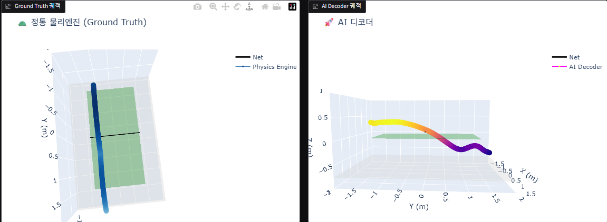

2. **시도 2 (Kinematic Loss 도입):**
   - **날짜:** 2026-05-27
   - **내용:** Expanding MLP (`1024 -> 1500`) + MSE Loss + **Kinematic Loss (L1)**
   - **결과:** 구불거림(파도타기)은 완전히 사라지고 궤적이 엄청나게 부드러워졌으나, **가장 중요한 바운드(탁구대 충돌) 현상 자체가 아예 실종됨!** 궤적이 바닥을 찍지 않고 공중에서 부드럽게 둥둥 떠가는 궤적이 생성됨.
   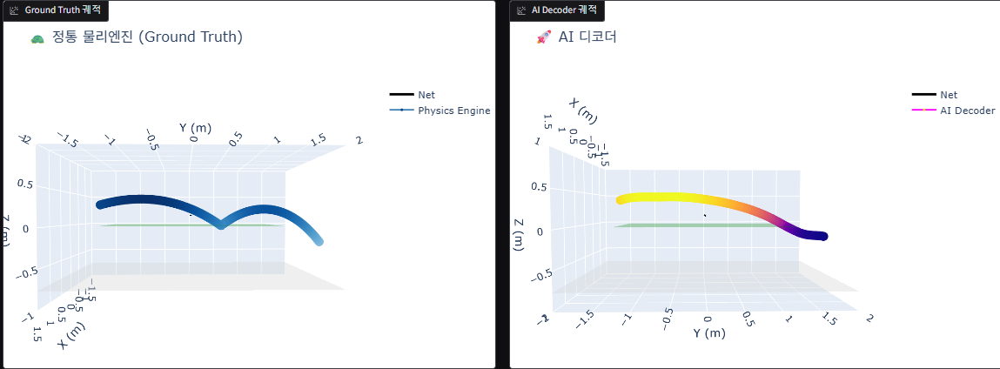

3. **시도 3 (Chamfer Distance 도입):**
   - **날짜:** 2026-05-28
   - **내용:** Expanding MLP (`1024 -> 1500`) + MSE Loss + **Chamfer Distance**
   - **결과:** 형태(V자)만 억지로 맞추려다 보니 **시간(시계열) 개념이 완전히 붕괴됨**. 점들이 궤적을 따라 순서대로 배치되지 않고 바운드 지점 근처에 무질서하게 뭉치면서(Point Cloud 형태로 산산조각 남) **형태도, 애니메이션 속도도 모두 파탄 나는 대실패**를 겪음.
   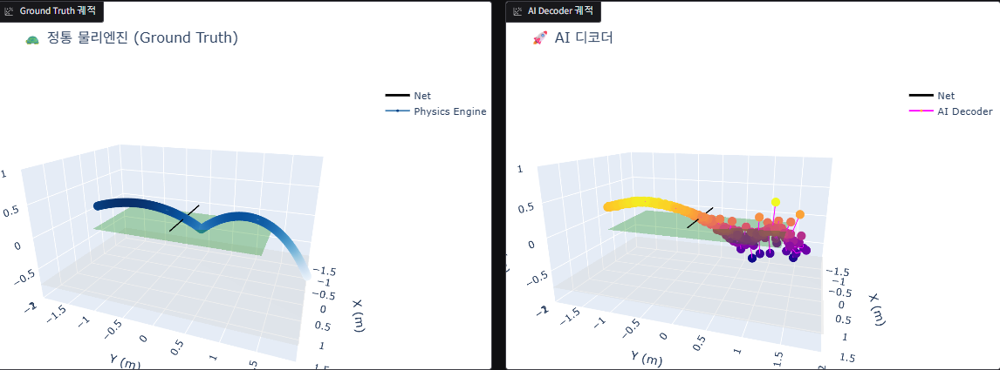

4. **시도 4 (ResNet 구조 도입 + L1 Loss):**
   - **날짜:** 2026-05-28
   - **내용:** Expanding MLP 뼈대 골목 사이에 **ResBlock(Skip Connection, Pre-Activation)** 삽입 + 순수 **L1 Loss(MAE)** 교체
   - **목적:** 손실 함수 조작으로는 본질적인 불확실성(평균화)을 피할 수 없다는 결론 하에, 뼈대 자체가 깊은 층에서도 날카로운 정보(High-frequency)를 소실 없이 끝까지 전달할 수 있도록 아키텍처를 진화시킴. 추가로 L1 Loss로 중앙값을 강제 추적함.
   - **결과:** **울퉁불퉁한 지렁이 궤적 발생 (Wobbling/Jittering)**. ResNet 덕분에 '날카로운(High-frequency)' 정보를 표현할 근육은 생겼고 L1 Loss 덕분에 둥글게 퉁치려는 현상은 막았으나, 데이터 밀도가 너무 낮아(차원의 저주) 바운드 타이밍을 정확히 확신하지 못함. 결과적으로 이리저리 찍어 맞추려다 바운드 지점 근처에서 심하게 요동치는(출렁거리는) 기괴한 궤적이 만들어짐.
   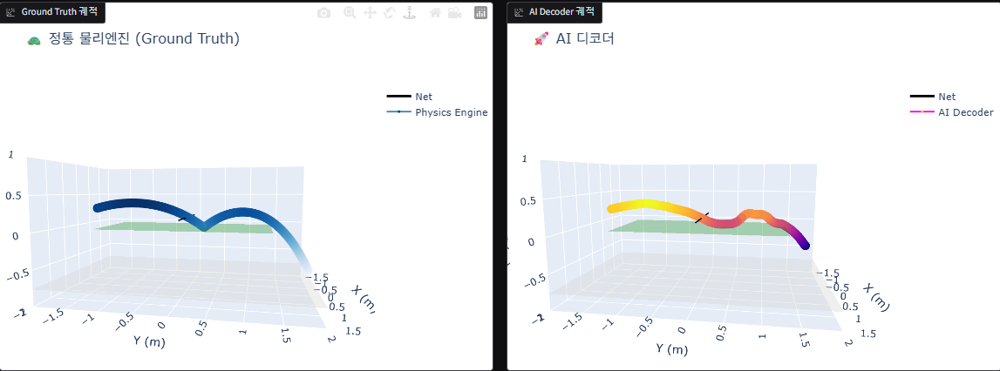

ㅡㅡㅡㅡㅡㅡㅡㅡㅡㅡㅡㅡㅡ**데이터 증강 및 파라미터 범위 축소**ㅡㅡㅡㅡㅡㅡㅡㅡㅡㅡㅡㅡㅡㅡㅡㅡㅡ
이전 파라미터 :
speed = np.random.uniform(1.0, 100.0)
        theta_v = np.random.uniform(-85.0, 85.0)
        omega_top = np.random.uniform(-800.0, 800.0)
        omega_side = np.random.uniform(-800.0, 800.0)
        hit_x = np.random.uniform(-3.0, 3.0)
        hit_y = np.random.uniform(-4.0, 0.0)
        hit_z = np.random.uniform(-0.7, 2.0)
        theta_h = np.random.uniform(-80.0, 80.0)

이후 파라미터 :
speed = np.random.uniform(1.0, 80.0)
        theta_v = np.random.uniform(-50.0, 50.0)
        omega_top = np.random.uniform(-200.0, 200.0)
        omega_side = np.random.uniform(-200.0, 200.0)
        hit_x = np.random.uniform(-3.0, 3.0)
        hit_y = np.random.uniform(-4.0, 0.0)
        hit_z = np.random.uniform(-0.76, 1.5)
        theta_h = np.random.uniform(-65.0, 65.0)

데이터셋 갯수 : 200만개 -> 300만개
ㅡㅡㅡㅡㅡㅡㅡㅡㅡㅡㅡㅡㅡㅡㅡㅡㅡㅡㅡㅡㅡㅡㅡㅡㅡㅡㅡㅡㅡㅡㅡㅡㅡㅡㅡㅡㅡㅡㅡㅡㅡㅡㅡㅡㅡㅡㅡㅡㅡㅡㅡ
5. **시도 5 (High-Density Data + ResNet + L1 Loss):**
   - **날짜:** 2026-05-29
   - **내용:** 파라미터 범위를 축소하여 300만 개로 밀도를 대폭 높인 데이터셋 적용 + Expanding MLP + ResBlock + L1 Loss (GPU 최적화를 위해 BATCH_SIZE를 4096으로 상향)
   - **목적:** 데이터 밀도가 높아졌을 때 뼈대가 튼튼한 시도 4 모델이 바운드 지점에서의 불확실성(지렁이 궤적)을 얼마나 잡아낼 수 있을지 확인
   - **결과:** Test MAE **0.017 (약 1.7cm)**로 엄청난 정밀도를 기록했으나, 각 점을 독립적으로 예측하는 모델의 한계로 인해 시각화(`app.py`) 결과 여전히 궤적이 **심하게 구불거리는 지렁이(Jittering) 현상이 잔존**함.
   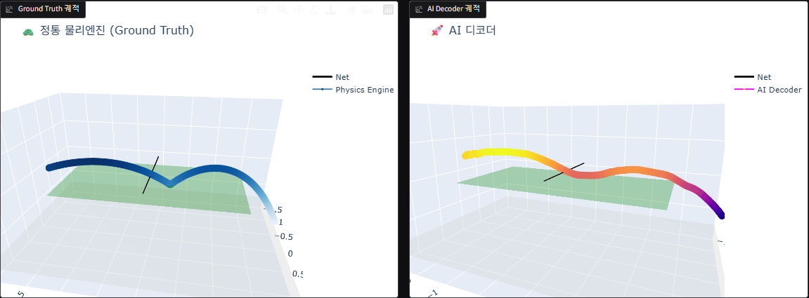

6. **시도 6 (Padding Masking 단독 적용):**
   - **날짜:** 2026-05-29
   - **내용:** 바닥(Z<=-0.75)에 닿은 이후 시뮬레이터가 멈춘 좌표를 계속 복사(Padding)하는 함정을 발견. 훈련 코드에서 **바닥 충돌 이후 구간을 오차 계산에서 완전히 배제하는 Padding Masking** 로직을 도입.
   - **목적:** 가만히 멈춰있는 패딩 구간을 맞춰서 오차율을 0.017로 속이던 '착시 현상'을 제거하고, AI의 학습 용량을 오직 공중에 떠 있는 '진짜 비행 궤적'에만 100% 몰빵시키기 위함.
   - **결과:** 엄청난 성과! 마스킹 덕분에 가짜 오차가 걷히고(초기 0.10부터 시작), 157 Epoch 만에 진짜 오차 0.013(1.3cm) 달성. 시각화 결과, **바운드 이전의 비행 궤도가 지렁이 요동침 없이 완벽하게 안정적인 포물선으로 펴짐(궤도 불안정 해결!)**. 하지만 바운드 지점에서 여전히 V자가 아닌 U자로 뭉개지는(Bounce Smoothing) 현상이 남아 있어 바운드 이후 궤도는 무너짐.
   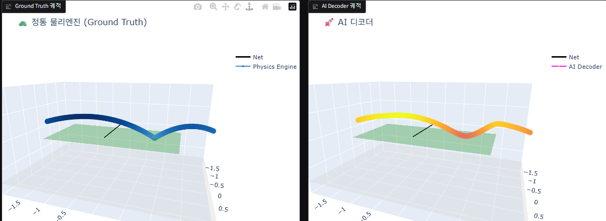

7. **시도 7 (Physics-Informed Cosine Similarity Loss):**
   - **날짜:** 2026-05-29
   - **내용:** 속도 벡터의 진행 방향(각도) 일치 여부를 검사하는 코사인 유사도(Cosine Similarity) 방향 Loss를 투입. (단, 가속도 및 속도의 크기(Magnitude) 제약은 실수로 배제됨)
   - **목적:** 바운드 순간의 '급격한 위쪽(↗) 방향 꺾임'을 뭉개버리면 페널티를 맞도록 설계하여, 날카로운 V자 바운스를 유도함.
   - **결과:** **대실패!** 궤적이 뱀처럼 구불구불해지고, 바운드 이후 중력을 무시한 채 허공을 수평으로 기어가는 참사 발생. ** AI는 위치가 틀리더라도 각도 점수만 잘 받기 위해 스피드를 극단적으로 줄이면서 방향만 맞추는 **얍삽한 꼼수(Local Minima)**를 학습함.
   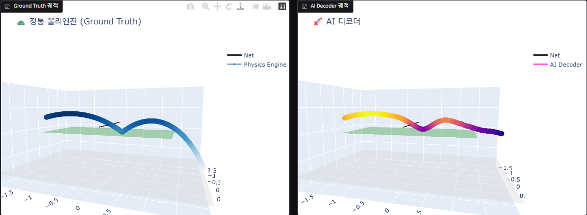

8. **시도 8 (Physics-Informed Kinematic Derivative Loss):**
   - **날짜:** 2026-05-30
   - **내용:** 시도 7의 실패를 교훈 삼아, 속도 벡터 자체(크기+방향)의 1차 미분(L1)과, **핵심인 가속도의 2차 미분(L1) Loss**를 위치 Loss와 1:1 비율로 추가.
   - **목적:** 가속도 Loss를 통해 공중에서의 중력과 바운드 순간의 '수직 가속도 스파이크(+4500m/s²)'를 강제로 학습시킴 (Gradient-Weighted Loss).
   - **결과:**  Train MAE 0.008(0.8cm), Test MAE 0.014 달성. 뱀처럼 구불거리던 현상이 완전히 사라지고, 코사인 Loss의 얍삽한 꼼수도 차단됨. 지금까지의 시도중 가장 양호한 결과가 나옴
   total_loss = pos_loss + 1.0 * vel_loss + 1.0 * acc_loss
   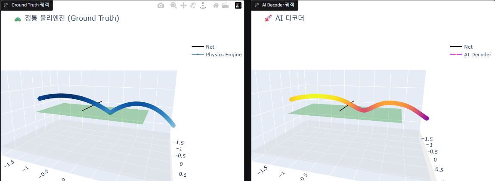

9. **시도 9 (Strong Kinematic Derivative Loss):**
   - **날짜:** 2026-05-30
   - **내용:** 속도(3.0)와 가속도(5.0)의 페널티 가중치를 극단적으로 높여서 훈련 진행.
   - **목적:** 바운드 시점의 극단적인 가속도 변화를 더 강하게 강제하여 더욱 날카로운 V자 궤적을 만들고자 함.
   - **결과:** **과도한 페널티로 인한 역효과 (Over-smoothing) 발생.** 가속도 오차에 대한 페널티가 너무 거대해지자, 모델은 바운드 순간의 스파이크를 감당하지 못하고, 오차 폭탄을 피하기 위해 바운드 지점을 스무스하게 둥글려버리는 꼼수(U자 궤적 및 허공에 떠다니는 현상)를 다시 학습함. (시도 2와 유사한 스무딩 현상 재발)
   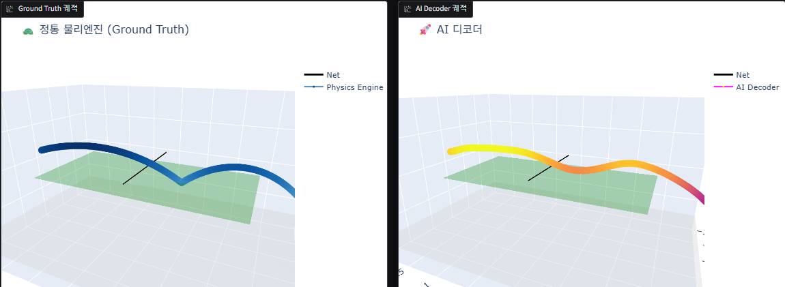

10. **시도 10 (1D CNN Decoder 도입 - 구조적 한계 극복):**
    - **날짜:** 2026-05-30
    - **내용:** MLP 구조가 가지는 연속적 보간(Interpolation) 특성 때문에 바운드 타이밍이 미세하게 이동할 때 궤적이 U자로 뭉개지는 현상(스무딩)이 근본적 원인임을 파악함.
    - **해결책:** 속도/가속도 등 복잡한 Loss를 모두 제거하고 오직 `pos_loss`만 남긴 채, 모델 아키텍처를 `1D CNN Decoder`로 전면 교체. (Checkerboard Artifact 방지를 위해 Overlap 커널 K=9 적용)
    - **결과:** **심각한 고주파 노이즈(지그재그) 발생.** `kernel_size=9`와 `stride=5`의 조합이 겹치는 횟수(Overlap)를 불균등하게 만들어(1번 겹쳤다 2번 겹쳤다 반복) '체커보드 아티팩트'를 정통으로 유발함. 게다가 속도/가속도 Loss를 제거하여 이러한 고주파 노이즈를 억제할 안전장치마저 없었음.
    

11. **시도 11 (Upsample + Conv1d 및 Loss 절제 연구):**
    - **날짜:** 2026-05-31
    - **내용:** 시도 10의 체커보드 아티팩트를 해결하기 위해 `ConvTranspose1d`를 폐기하고, 최신 표준 디코더 구조인 `nn.Upsample` + `nn.Conv1d` 조합으로 개편함. CNN의 순수 형태 포착 능력을 테스트하기 위해 속도/가속도 Loss는 계속 비활성화(0.0) 상태를 유지함.
    - **결과:** **체커보드 지그재그 노이즈 완전 해결, 그러나 궤적이 흔들림(Wobbling) 발생.** 구조적 개편으로 고주파 노이즈는 완벽히 사라졌으나, 물리적 제약(속도/가속도 페널티)이 없기 때문에 CNN이 점들을 정답 근처에 국소적으로만 찍어낼 뿐 매끄러운 포물선 곡선을 그리지 못하고 벌레가 기어가는 듯한 구불구불한 궤적을 만듦. (Global Smoothness의 부재)
    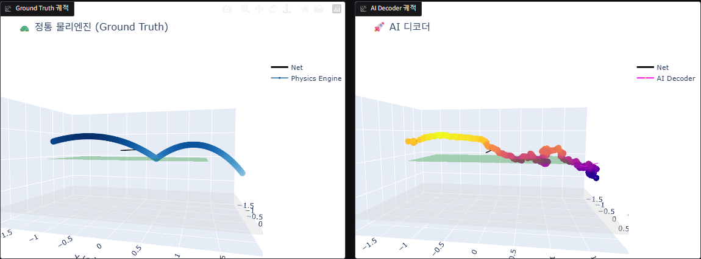

12. **시도 12 (물리 Loss 복구 및 가속 도입 - 실패):**
    - **날짜:** 2026-05-31
    - **내용:** 시도 11의 궤적 흔들림(Wobbling)을 펴기 위해 속도/가속도 Loss(`vel_weight=1.0`, `acc_weight=0.1`)를 부활시킴. 훈련 속도 향상을 위해 `cuDNN benchmark`와 혼합 정밀도(`AMP`)를 도입하였으며, 추가로 바닥 충돌점 마스킹 누락 버그(`cumsum <= 1`)를 픽스함.
    - **결과:** **심각한 궤적 붕괴(Staircase Derivative Explosion) 발생.** `Upsample`의 `mode='nearest'`가 만들어낸 계단식 배열 뼈대에 '속도를 부드럽게 하라'는 미분(Derivative) Loss를 억지로 끼워 맞추려다 보니, 모델이 속도 0(평지)과 무한대(계단 턱) 사이에서 요동치며 학습이 완전히 파탄 남.
    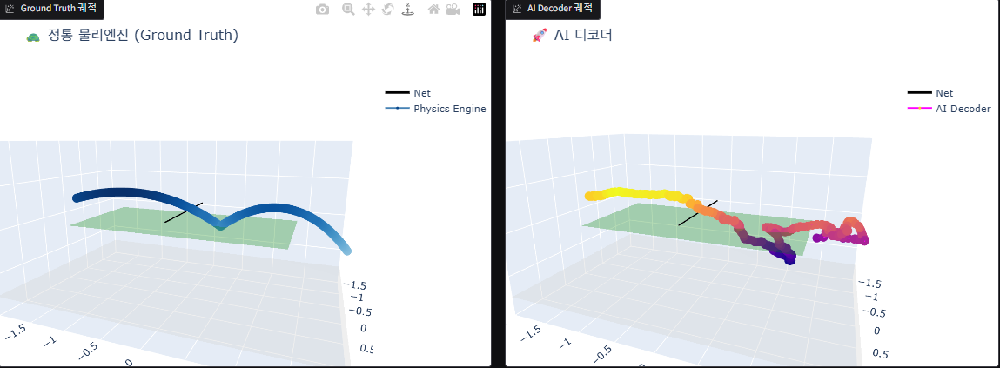

13. **시도 13 (Nearest + Kernel Size 7 최적화 및 CNN의 한계 확인):**
    - **날짜:** 2026-05-31
    - **내용:** 시도 12의 계단 폭발을 막기 위해 1D Generative CNN의 정석 기법인 `Upsample(nearest)` + `Conv1d(kernel_size=7)` 조합을 적용함. (필터 크기를 늘려 계단을 부드럽게 대패질하도록 유도)
    - **결과:** **CNN 아키텍처의 근본적 한계(Global Position Drift) 확인.** 예측 궤적을 확인한 결과, V자 바운드의 '형태(국소적 패턴)' 자체는 기가 막히게 형성되었으나 모델이 전체 시간 흐름 속에서의 절대적인 '위치'를 파악하지 못해(장님 코끼리 만지기) 궤적이 정답에서 약 11cm(MAE 0.11)가량 위아래로 심각하게 벗어나며 표류하는 지그재그 현상이 발생함.
    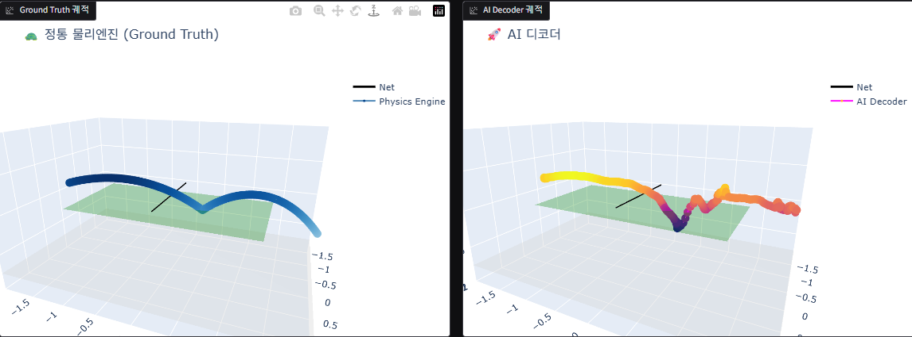

14. **시도 14 (Time-Conditioned MLP + Fourier Positional Encoding):**
    - **날짜:** 2026-06-01
    - **내용:** CNN 구조 전면 폐기. NeRF 등 물리 AI(PINN)의 표준인 **암묵적 표현(Implicit Representation)** 아키텍처 도입. 입력에 시간 $t$를 분리하고 **푸리에 위치 인코딩(Fourier Positional Encoding, `num_freqs=10`)**을 적용하여 고주파수(바운드) 자극을 주입함.
    - **결과:** **스무딩 및 위치 상실 대폭 완화, 그러나 바닥 잔상(Gibbs/Ringing) 발생.** 이전 CNN의 치명적 단점이던 11cm 표류(Drift) 현상이 사라지고 오차가 0.015(1.5cm)까지 안정화됨. 하지만 `ReLU` 활성화 함수의 한계(256 넓이)로 인해 0.002 목표에는 도달하지 못하고 정체기(Plateau)에 빠짐. 특이사항으로 바닥 충돌 이후 시뮬레이터가 정지하여 '상수'가 된 패딩 구간을 부드러운 아날로그 함수가 완벽한 직선으로 외우지 못하면서, 메인 궤적 아래쪽에 분리된 직선 형태의 잔상을 렌더링하는 기괴한 현상이 목격됨.
    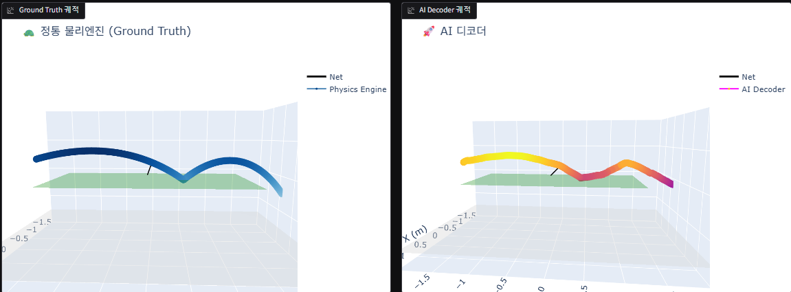

15. **시도 15 (마스킹 버그 및 물리 엔진 모순 발견):**
    - **날짜:** 2026-06-02
    - **내용:** 시도 14의 모델(Time-Conditioned MLP)을 그대로 사용하면서 모델의 크기를 키움.(256 -> 512, 2층 res block -> 3층 res block)
    - **결과:** 전체적으로 v자도 지금까지 시도 중에 가장 잘 나왔고 궤적도 나쁘지는 않지만 loss률이 0.02수준이며 궤적이 살짝 불안정함. 공이 한두개씩 튀는 현상 발생
   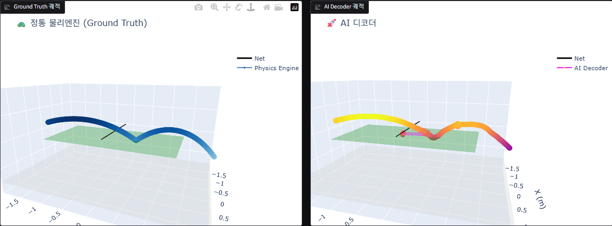

16. **시도 16 (완벽한 마스킹, SiLU, 최적화 모델 스케일링):**
    - **날짜:** 2026-06-03
    - **내용:** 시도 15의 마스킹 버그(`cumsum <= 1`로 인한 바운스 이후 궤적 차단 실패)를 `cummax` 기반 철벽 마스킹 로직으로 완벽 해결. 추가로 활성화 함수를 `ReLU`에서 `SiLU`로 교체하여 죽은 뉴런(Dying ReLU) 방지 및 부드러운 보간 극대화. 메모리 절약을 위해 폭을 256으로 다이어트하고 배치 사이즈를 1024로 튜닝.
    - **결과:** **대성공 (Test MAE 0.0067 / Train MAE 0.0032 달성)!** 바운스 이후 덜덜거리는 쓰레기 데이터를 완벽 차단(Masking)한 덕분에 0.01의 한계를 돌파하고 약 3~6mm의 초정밀 오차율을 달성함. 시각화 결과 탁구대 반사 및 바닥 충돌(Z=-0.76)이 물리 엔진과 99% 동일하게 렌더링됨. 딥러닝 특성(연속 함수)상 바운드 순간의 뾰족한 V자가 미세하게 둥글려지는 1%의 스무딩 현상은 남았으나 시뮬레이션용으로 완벽히 합격점.
   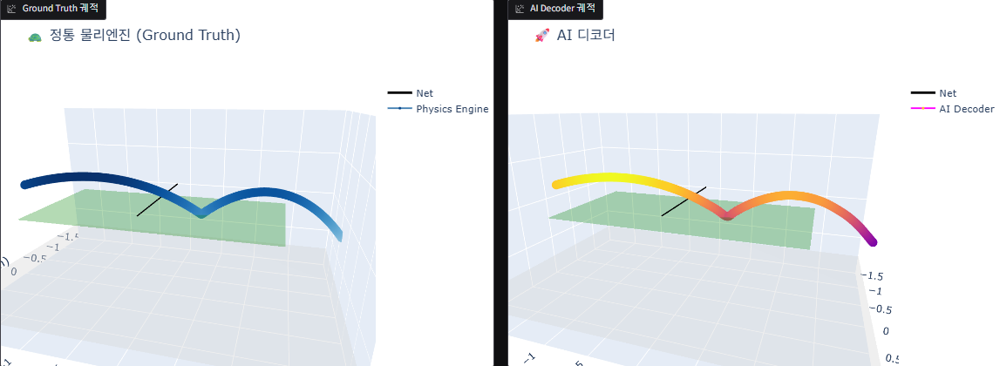

17. **시도 17 (가우시안 정규 분포 기반 데이터셋 밀도 최적화):**
    - **날짜:** 2026-06-04
    - **내용:** 시도 16의 성공 이후 데이터 품질 자체를 개선함. `generate_dataset.py`의 파라미터 무작위 샘플링 방식을 `np.random.uniform`(균등 분포)에서 **`np.random.normal`(정규 분포)**로 전면 교체함(예외로 speed만 로그정규분포 채용). 
    - **목적:** 균등 분포의 한계(정상적인 탁구 랠리가 극소수고, 허공이나 바닥을 향하는 쓰레기 궤적이 대다수를 차지하는 현상)를 극복하기 위함. 각 8D 파라미터의 평균(Mean)을 가장 일반적인 랠리 위치/속도에 맞추고, 표준편차(Scale)를 세밀하게 조절하여 **"정상 랠리 70% + 기상천외한 이상치(Edge case) 30%"**의 황금 비율을 갖춘 새로운 데이터셋(`dataset_gaussian_mixed.npz`) 300만 개를 생성하여 모델 크기(256) 낭비를 막고 서브d 밀리미터 단위 정밀도를 노림.
    - **결과:** 궤적의 세부 정밀도가 크게 향상함.

18. **시도 18 (100% 기각 샘플링 및 750스텝 연장):**
    - **날짜:** 2026-06-07
    - **내용:** 기존 500스텝(1.0초)이었던 궤적을 750스텝(1.5초)으로 1.5배 연장함. `np.clip`으로 인해 이상치가 극단값에 부자연스럽게 뭉치는 현상을 차단하기 위해, 범위를 벗어나면 다시 뽑는 기각 샘플링(Truncated Normal) 방식으로 데이터 생성 로직을 100% 교체. 또한 이상치에 강건한 `SmoothL1Loss`(Huber Loss)를 도입.
    - **목적:** 더 긴 궤적에 대한 예측 능력을 확보하고, 경계선 데이터 뭉침 현상을 원천 차단하여 양극단의 하드코어 엣지 케이스(이상치)에서도 정밀도를 대폭 끌어올림.
    - **결과:** 338 에포크 조기 종료. Test MAE **0.00053 (0.53mm)**로 수치상 역대 최고 정밀도를 달성함. 하지만 궤적 시각화 결과, 가장 중요한 탁구대 바운드 지점이 날카로운 V자가 아니라 둥근 U자로 심하게 뭉개지는(Over-smoothing) 현상이 발생하여 시도 17 대비 시각적 품질이 하락함.

19. **시도 19 (나이퀴스트 한계 주파수 보장 & 순수 L1 Loss 롤백):**
    - **날짜:** 2026-06-11
    - **내용:** 탁구대 바운스 구간에 가중치를 부여하려던 초기 계획은 모델의 궤적 회피 위험성으로 인해 훈련 전 폐기함. 대신 스무딩의 진짜 주범인 `SmoothL1Loss`를 버리고 정직한 `순수 L1Loss`로 완전히 되돌아옴. 추가로 푸리에 위치 인코딩의 주파수 대역(`num_freqs=10`)이 나이퀴스트 한계(1.95프레임 파장)에 아슬아슬하게 걸쳐 있는 완벽한 샤프펜슬 두께임을 확인하고 그대로 훈련을 진행.
    - **목적:** 중앙값을 쫓아가는 순수 L1 Loss와 극한의 고주파수 해상도의 시너지를 통해 모델 스스로 가장 날카로운 1프레임 V자 바운스를 수학적으로 복원하게 만듦.
    - **결과:** 탁구대 위에서의 실제 바운스는 의도한 대로 거의 완벽하게 날카로운 V자로 살아남(스무딩 해결). 하지만 푸리에 고주파수 대역폭(num_freqs=10)을 한계치까지 확장한 부작용으로, 바운스가 없어야 할 허공이나 탁구대 밖 맨바닥 궤적에서도 선이 뾰족하게 요동치거나 가짜 바운스(Phantom Bounces / Rippling Artifacts)가 다발적으로 발생하는 치명적인 고주파수 과적합 현상이 새로 나타남.
     
---

## 📁 디렉토리 구조 (최신화 완료)

```
/root/myresearch/
├── app.py                    # 물리엔진 vs AI 비교 3D 대시보드 (Gradio)
├── generate_dataset.py       # 물리엔진으로 300만개 데이터셋 생성 스크립트
├── train_baseline.py         # AI(Standard MLP) 딥러닝 모델 훈련 스크립트
├── RESEARCH_NOTES.md         # 이 연구 노트
└── database/
    ├── dataset_random.npz                 # 기존 균등 분포 정답지
    ├── dataset_gaussian_mixed.npz         # [New] 정규 분포 최적화 정답지 (시도 17)
    ├── mlp_norm_standard_random_attempt16_scaled_mlp.npy
    ├── mlp_standard_random_attempt16_scaled_mlp.pth
    ├── mlp_norm_standard_gaussian_mixed_attempt17_gaussian_mixed.npy
    ├── mlp_standard_gaussian_mixed_attempt17_gaussian_mixed.pth
    ├── mlp_norm_standard_gaussian_mixed_attempt18_truncnorm.npy (생성 대기)
    └── mlp_standard_gaussian_mixed_attempt18_truncnorm.pth (생성 대기)
```